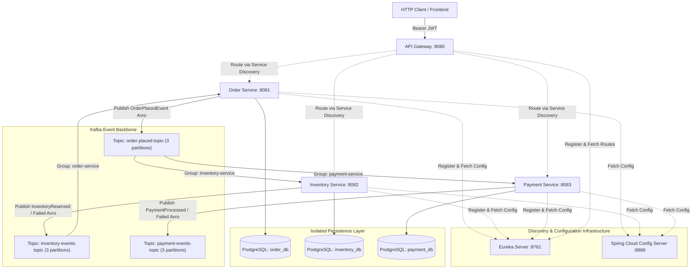

# Distributed E-Commerce Microservices (Event-Driven Architecture)

A robust, reactive, event-driven e-commerce microservices ecosystem built using **Java 17+**, **Spring Boot 3**, **Spring Cloud (2023.x)**, **Apache Kafka**, **Apache Avro**, **PostgreSQL**, and **Reactive Spring Security**.

---

## 🏛 System Architecture



---

## 🔌 Port & Service Map

| Service Name | Port | Responsibilities | Default Database / Store |
| :--- | :--- | :--- | :--- |
| **`eureka-server`** | `8761` | Service Registry & Discovery Server | In-Memory Registry |
| **`config-server`** | `8888` | Centralized Configuration Server (Native / Git profile) | Native file repository (`resources/config`) |
| **`api-gateway`** | `8080` | Spring Cloud Gateway, Reactive JWT HMAC-SHA256 Auth, Routing | Stateless / Reactive Filter Chain |
| **`common-events`** | N/A | Shared Apache Avro Schemas & Custom Kafka (De)serializers | Library Module |
| **`order-service`** | `8081` | Order Placement, Outbox Event Store, Order Status Updates | PostgreSQL `order_db` (H2 fallback) |
| **`inventory-service`** | `8082` | Stock Reservation, Shortage Detection, Inventory Management | PostgreSQL `inventory_db` (H2 fallback) |
| **`payment-service`** | `8083` | Payment Processing Simulation, Transaction Records | PostgreSQL `payment_db` (H2 fallback) |

---

## ⚡ Event-Driven Messaging (Apache Kafka & Avro)

### 1. Distinct Consumer Groups
- **`inventory-service`**: Consumes `order-placed-topic` to evaluate stock and reserve items independently.
- **`payment-service`**: Consumes `order-placed-topic` to execute payment deduction independently.
- **`order-service`**: Consumes `inventory-events-topic` to transition order status (`CONFIRMED` or `REJECTED`).

### 2. Kafka Topics (Configured with 3 Partitions)
- `order-placed-topic` (Partition key: `orderNumber`)
- `inventory-events-topic` (Partition key: `orderNumber`)
- `payment-events-topic` (Partition key: `orderNumber`)

### 3. Apache Avro Schemas (`common-events/src/main/resources/avro/`)
- `OrderPlacedEvent.avsc` (nested `OrderItemRecord`)
- `InventoryReservedEvent.avsc` (nested `ReservedItemRecord`)
- `InventoryReservationFailedEvent.avsc`
- `PaymentProcessedEvent.avsc`
- `PaymentFailedEvent.avsc`

Binary serialization and deserialization are handled with `AvroSerializer` and `AvroDeserializer`, carrying schema metadata dynamically via the `avro_schema` Kafka header.

---

## 🔐 Security & Gateway Routing

The API Gateway enforces stateless token authentication using **Spring Security OAuth2 Resource Server (Reactive)** with HMAC-SHA256.

- **Permitted Public Routes**: `/actuator/**`, `/swagger-ui/**`, `/v3/api-docs/**`
- **Protected Routes**: `/api/orders/**`, `/api/inventory/**`, `/api/payments/**`
- **Unauthorized Status**: Returns `401 Unauthorized` when the JWT token is missing, expired, or tampered with.

---

## 🚀 Getting Started & Local Execution

### Prerequisites
- Java 17 or higher
- Apache Kafka (`localhost:9092`)
- PostgreSQL (`localhost:5432`)

### 1. Launch Infrastructure (Docker)
```bash
docker run -d --name postgres -p 5432:5432 -e POSTGRES_PASSWORD=postgres postgres:15-alpine
docker exec -it postgres psql -U postgres -c "CREATE DATABASE order_db; CREATE DATABASE inventory_db; CREATE DATABASE payment_db;"

docker run -d --name kafka -p 9092:9092 apache/kafka:latest
```
*(Note: Each service includes an embedded H2 fallback in its `application.yml` for zero-dependency local testing).*

### 2. Build the Project
```bash
./gradlew clean build
```

### 3. Startup Order
Run each module in a separate terminal:

1. **Eureka Server**:
   ```bash
   ./gradlew :eureka-server:bootRun
   ```
2. **Config Server**:
   ```bash
   ./gradlew :config-server:bootRun
   ```
3. **API Gateway**:
   ```bash
   ./gradlew :api-gateway:bootRun
   ```
4. **Inventory Service**:
   ```bash
   ./gradlew :inventory-service:bootRun
   ```
5. **Payment Service**:
   ```bash
   ./gradlew :payment-service:bootRun
   ```
6. **Order Service**:
   ```bash
   ./gradlew :order-service:bootRun
   ```

---

## 🧪 Testing the APIs

### 1. Check Eureka Dashboard
Open `http://localhost:8761` to verify all services (`API-GATEWAY`, `ORDER-SERVICE`, `INVENTORY-SERVICE`, `PAYMENT-SERVICE`) are registered.

### 2. Verify Config Server
```bash
curl http://localhost:8888/order-service/default
```

### 3. Send Request via API Gateway
Without JWT (Expect `401 Unauthorized`):
```bash
curl -i http://localhost:8080/api/orders/ORD-1234
```

With JWT Token:
```bash
curl -i http://localhost:8080/api/orders \
  -H "Authorization: Bearer <VALID_JWT_TOKEN>" \
  -H "Content-Type: application/json" \
  -d '{
    "customerEmail": "user@example.com",
    "items": [
      { "skuCode": "iphone_15", "price": 799.99, "quantity": 1 }
    ]
  }'
```